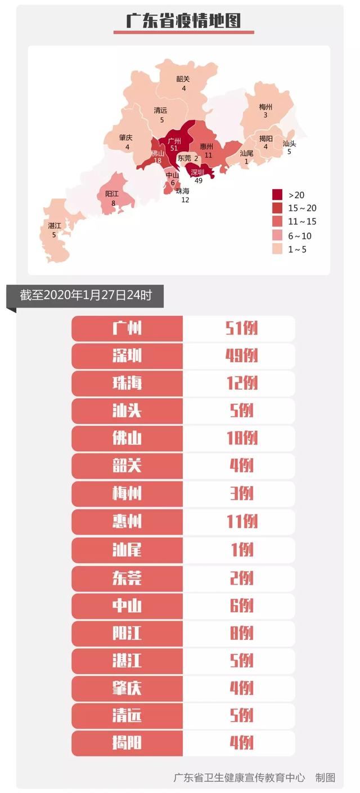
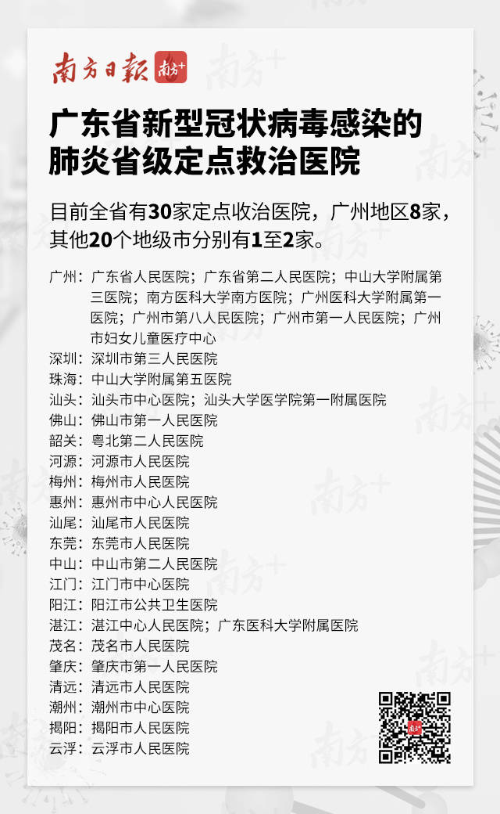
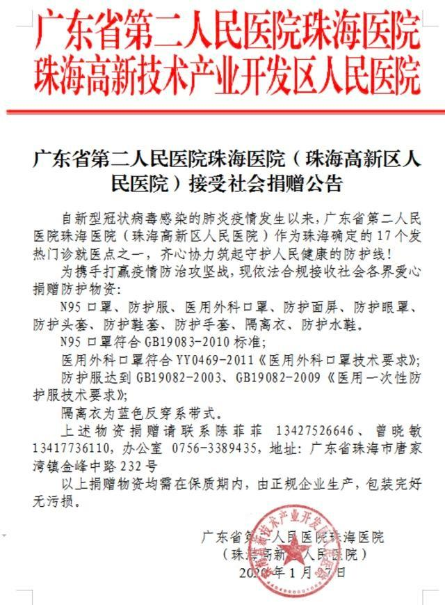

# 汇总广东方面关于武汉新型冠状病毒的官方信息

## 信息提供

信息持续更新中。

如果你有更新的数据和信息需要登记，可直接提PR或新建issue。

## [官方实时数据统计](data/DATA.md)

截止2020年1月27日24时：广东省新型冠状病毒肺炎新增确诊病例42例，累计188例。

## [官方指定医院](hospital/HOSPITAL.md)

## [官方捐赠信息](donate/DONATE.md)

广东省第二人民医院（珠海高新区人民医院）接受社会捐赠公告

